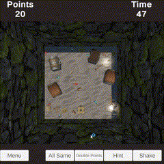

# 3D Object Matching Game

## [**WebGL Game Link**](https://tancperin.github.io/bakircay-2024-gd-220601125/)

## Table of Contents
- [Introduction & Game Details](#introduction--game-details)
    - [Game Objects](#game-objects)
    - [Game Modes](#game-modes)
    - [Game Mechanics](#game-mechanics)
        - [Object Interaction](#object-interaction)
        - [Golden Object](#golden-object)
        - [Skills](#skills)
    - [UI Elements](#ui-elements)
        - [Main Menu](#main-menu)
        - [Game Area](#game-area)

## Introduction & Game Details
This is a 3D object matching game that is developed using Unity3D and C#. 
In this game the player has to match the 3D objects with their pairs.
All objects are chosen randomly from a pool of objects and are placed in a grid.

### Game Objects
There are 20 different objects in the pool:
- Barrel\

- Red Book\

- Green Book\

- Brown Book\

- Bottle\

- Candle\

- Candlestick\

- Cup\

- Jar\

- Jug\

- Lantern\

- Red Long Potion\

- Blue Long Potion\

- Red Small Potion\

- Blue Small Potion\

- Red Potion\

- Blue Potion\

- Sandglass\

- Scale\

- Chest\

Selected objects will be spawned according to the item count selection by the player.

### Game Modes
There are two game modes:
#### Pairs
\
In this mode, the player has to match the objects with their pairs. This game mode splits to 3 levels:
- 10 pairs
- 25 pairs
- 40 pairs\
In each level, the player has to match the objects with their pairs. In levels, there will be specified amount of pairs that the player has to match. (e.g. 10 pairs, total 20 objects)
#### Unlimited
\
In this mode, the player can play the game without any restrictions. The objects will spawn infinitely and the player can match them as much as they want.

### Game Mechanics
#### Object Interaction
The player can interact with the objects by clicking on them. When the player clicks on an object, the object will be held on the cursor. The player can release the object by clicking again. If the player releases the object on a correct pair, the objects will be destroyed. If the player releases the object on an incorrect pair, the object will be thrown out.\

#### Skills
There are total of 4 skills in the game:
- **Shake**: This skill allows player to shake the objects in the game area. The player can use this skill by pressing the `Shake` button. This skill can be used any time, but it has a cooldown time of 5 seconds.\

- **Hint**: This skill shows a pair of objects by highlighting them. The player can use this skill by pressing the `Hint` button. This skill can be used any time, but it has a cooldown time of 5 seconds.\
\
- **Double Points**: When this skill is used, all the objects starts moving and the player has to match them. Every correct pair will give the player double points. This skill can used any time, but it has a cooldown time of 5 seconds.\
\
- **All Same**: This skill makes all objects in the game area the same. This skill can be used any time, but it has a cooldown time of 5 seconds.\

### UI Elements
#### Main Menu
\
- **Pair 10**: Starts the game with 10 pairs.
- **Pair 25**: Starts the game with 25 pairs.
- **Pair 40**: Starts the game with 40 pairs.
- **Unlimited**: Starts the game in unlimited mode.
#### Game Area
In the game area, there are 3 UI parts:
- **Top Bar**: This area shows player's current score and the time that passed.\

- **Bottom Bar**: This area contains `Pause Menu Button`, `Advanced Skill (Hint, Refresh, All Same) Button` and `Basic Skill (Shake) Button`.\

- **Pause Menu**: This menu contains `Resume`, `Retry` and `Main Menu` buttons.\
